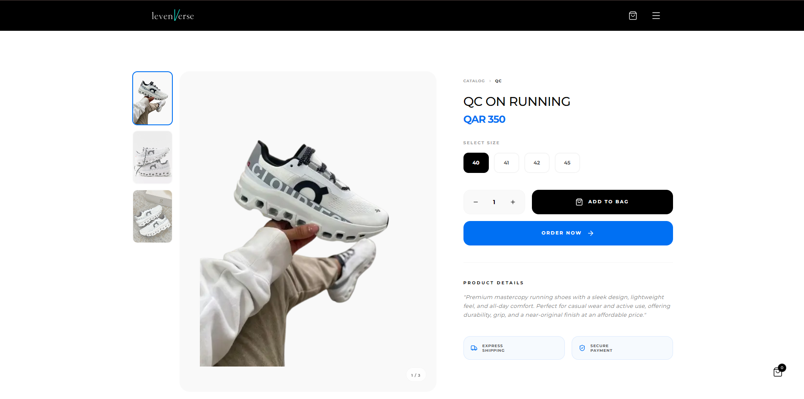

<p align="center">
  
</p>

# 👟 Levenverse — Premium Footwear E-Commerce Platform

🔗 **Live:** https://levenverse.com

A production-grade e-commerce platform built for the premium footwear market in Qatar. Designed with a focus on performance, seamless user experience, and real-world business workflows.

---

## 🚀 Overview

Levenverse is a full-stack web application that delivers a modern online shopping experience with fast performance, dynamic product browsing, and smooth cart interactions.

The system is built to handle real users, real inventory, and real transactions — not just a demo interface.

---

## ⚡ Key Features

- 🛍️ **Dynamic Product Browsing** — Category-based filtering with responsive UI updates
- 🛒 **Real-Time Cart System** — Instant add/remove with persistent state management
- 🔐 **Secure Admin System** — Role-based authentication for managing products and inventory
- 📩 **Automated Order Emails** — Transactional email system for order confirmations
- ⚡ **Fast Performance** — Optimized rendering using Next.js server-driven architecture
- 🎨 **Modern UI/UX** — Clean, responsive layout with smooth animations

---

## 🧠 Technical Highlights

- Built using **Next.js App Router** with server-driven rendering
- State managed using **Zustand** for fast and scalable client updates
- Custom **Express.js API** for handling business logic and admin workflows
- MongoDB with Mongoose for structured and scalable data handling
- Integrated **Nodemailer** for automated order processing system

---

## 🛠️ Tech Stack

**Frontend:** Next.js, React, Tailwind CSS
**State Management:** Zustand
**Backend:** Node.js, Express.js
**Database:** MongoDB (Mongoose)
**Other Tools:** Nodemailer, Better Auth, Framer Motion

---

## 📂 Project Structure (Simplified)

```
src/
 ├── app/            # Routes & layouts
 ├── components/     # UI components
 ├── store/          # Global state (Zustand)
 └── api/            # Backend logic
```

---

## ⚙️ Local Setup

```bash
git clone https://github.com/your-username/levenverse.git
cd levenverse
npm install
```

Create `.env.local`:

```
MONGODB_URI=your_mongodb_uri
BETTER_AUTH_SECRET=your_secret
NODEMAILER_USER=your_email
NODEMAILER_PASS=your_password
NEXT_PUBLIC_APP_URL=http://localhost:3000
```

Run the app:

```bash
npm run dev
```

---

## 🌍 Production Notes

- Deployed on **Vercel** with optimized routing and performance configuration
- Designed for real-world usage with dynamic data handling
- Focused on performance, scalability, and clean user experience

---

## 📌 Note

This is a real-world project built for production use, focusing on practical business needs rather than demo-only features.
